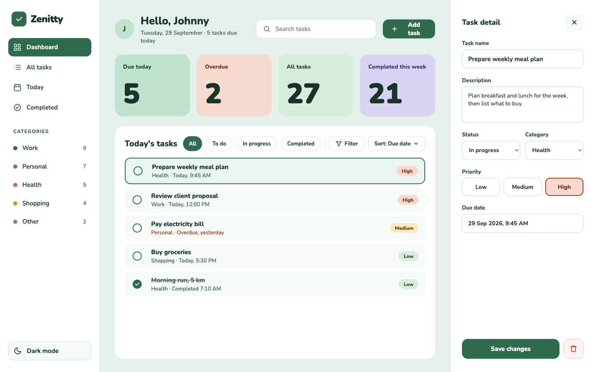
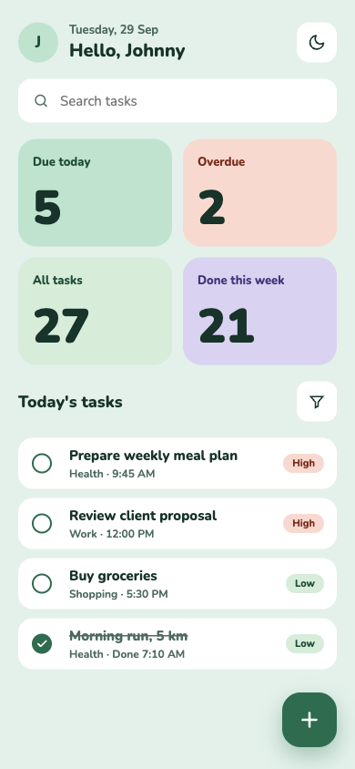
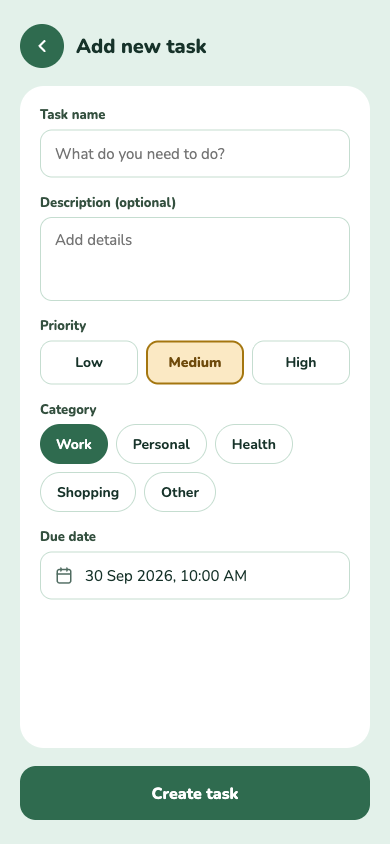
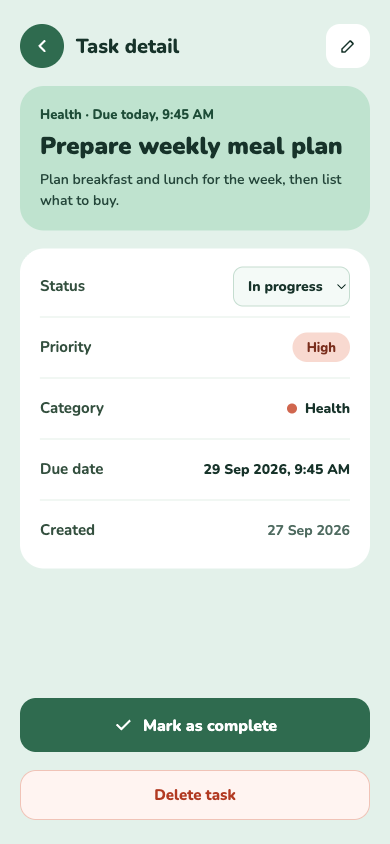
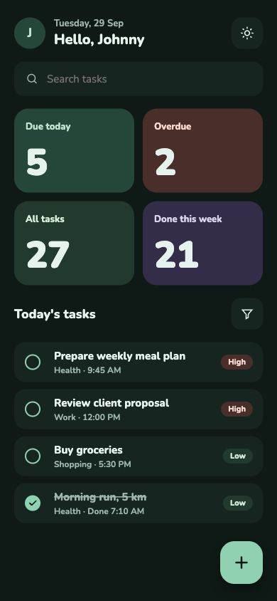

# Zenitty

A full-stack to-do list web app. React + Vite + TypeScript + Tailwind on the client, Express + Prisma (PostgreSQL) on the server. Single user, no auth in v1 — the display name comes from an env var.



| Home | Add task | Task detail | Dark mode |
|---|---|---|---|
|  |  |  |  |

## Features
- Task CRUD with a complete/incomplete toggle and a confirm dialog before delete
- Priority (badge + segmented control) and category (dot + select / pills)
- Dashboard stat cards (due today, overdue, all, completed this week) — click a card to filter the list
- Search, status chips, priority/category filter and sort, all kept in URL query params
- Dark mode: follows `prefers-color-scheme` on first visit, toggle in the sidebar (laptop) or header (mobile), saved in localStorage
- Responsive: laptop (3 columns), tablet (icon sidebar + modal), mobile (pages + bottom sheet)

## Setup
Requires Node 20+ and a PostgreSQL database. Easiest: Docker (`docker compose up -d`) or a free [Neon](https://neon.tech) database (paste its URLs into `.env`).

```bash
docker compose up -d   # local Postgres (skip if using Neon)
npm install
cp .env.example .env
npm run seed      # applies migrations and loads sample tasks
npm run dev       # client http://localhost:5173, API http://localhost:4000
```

## Scripts
| Command | What it does |
|---|---|
| `npm run dev` | Runs client and server together |
| `npm run build` | Builds server and client |
| `npm run lint` | Lints both workspaces |
| `npm run seed` | Applies migrations and reseeds sample data (**replaces all tasks**) |

## Environment
See [`.env.example`](.env.example): `PORT`, `DATABASE_URL`, `CLIENT_ORIGIN`, `VITE_USER_NAME`, `VITE_API_URL`.

## Project docs
- [AGENTS.md](AGENTS.md) — stack, folder map, conventions, API contract, design system and Git workflow
- [docs/design](docs/design) — mockups (the UI source of truth)

## Deploy to Vercel
The client is served as static files and the Express API runs as a Vercel serverless function (`api/index.ts`). Data lives in Postgres (SQLite can't be used on Vercel).

1. Push this repo to GitHub (or fork it).
2. Create a database: in Vercel, **Storage → Create → Neon (Postgres)**, or make one at neon.tech.
3. In Vercel: **Add New → Project → import the repo**. Leave the framework preset as "Other"; `vercel.json` already sets the build command and output directory.
4. Add these **Environment Variables** (Project → Settings → Environment Variables):
   | Name | Value |
   |---|---|
   | `DATABASE_URL` | Neon **pooled** connection string |
   | `DIRECT_URL` | Neon **direct / unpooled** connection string |
   | `VITE_USER_NAME` | The display name, e.g. `Abidemi` |
5. Deploy. The build applies the database migrations automatically (`npm run vercel-build`).
6. Optional sample data: run `npm run seed` locally with the production `DATABASE_URL`/`DIRECT_URL` in your `.env` (**this replaces all tasks**, so do it only on a fresh database).

Notes: "today" and "overdue" use the visitor's timezone (the client sends its offset). There is no login in v1, so anyone with the URL can edit the tasks.
